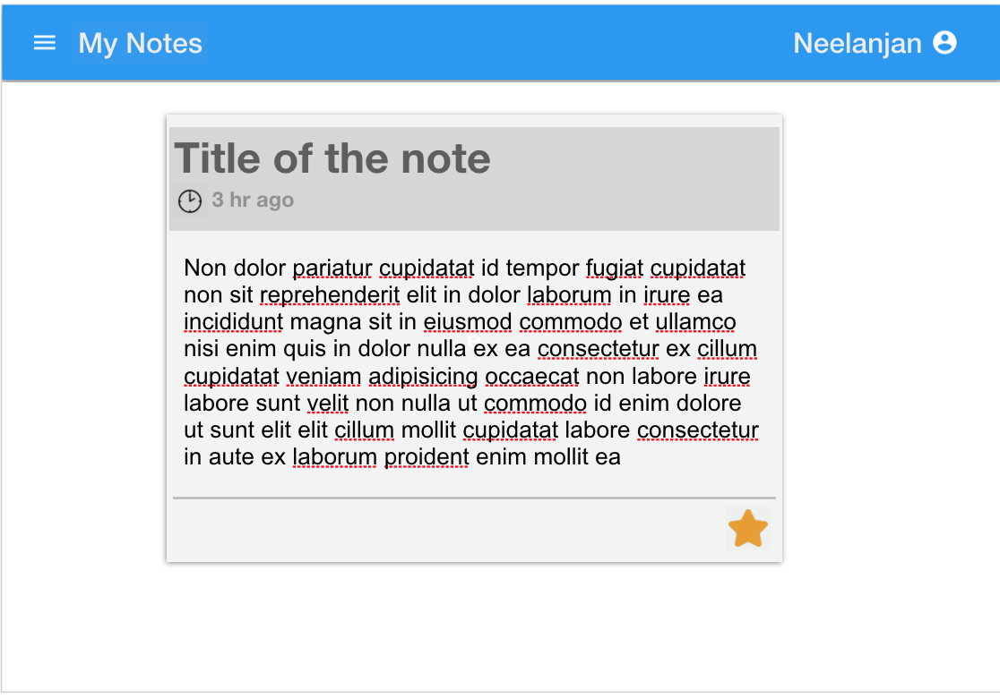

## Assignment for - Keep Application DAO
- Create **testable** Data Access Layer module for Keep Application with below data interaction methods, modularized in to their corresponding module
- Identify the required entities from the below given database interaction method specification
- Create the necessary data model and schema definition using MongooseJS
- Database connection has to be taken from environment variable `MONGO_URL`
- Derive required data model fields from the given Mock UI/Wireframe
- Create a mock object of the Notes in `./server/mock_note_obj.json`
- Create a mock object of the Group in `./server/mock_group_obj.json`
- Expose the DAO modules and connection method by updating with path to your modules/methods in `./server/modules.js`
- Collection name for notes will be `notes` and for the group it will be `groups`
- Bonus points if you maintain your unique identifier, instead of using default `_id`



## Below are the expected DAO modules and their exposed methods

#### Notes
```javascript
/*
 * Create a new note for the user, with the given details
 * PS: field 'createdOn' has to be set automatically by the system/DAO
 * without client having to specify
 *
 * Callback is returned with err & result, where result is the created or saved Note Object (type: Object)
 *
 */
addNote(userId, noteObj, done) {}

/*
 * Hard delete a specified note of the user
 * Food for thought: if it was part of a group, what you should do?
 *
 * Callback is returned with err & result, where result is the deleted Object (type: Object) or Id of the deleted object
 *
 */
deleteNote(userId, noteId, done) {}

/*
 * Update note details such as title & content
 * PS: field 'modifiedOn' has to be updated automatically by the system/DAO
 * without client having to specify
 *
 * Callback is returned with err & result, where result is the updated Note Object (type: Object)
 *
 */
updateNoteDetails(userId, updateDetails, done) {}

/*
 * Toggle the status flag for favorite field for the specified note of the user
 * i.e., if note is already marked as favorite, it will be now false and will
 * become not favorite, similarly if it was not favorite earlier, it has to
 * become true and will become favorite
 *
 * Callback is returned with err & result, where result is the updated Note Object (type: Object)
 *
 */
toggleNoteFavStatus(userId, noteId, done) {}

/*
 * Get specified note of the user
 *
 * Callback is returned with err & result, where result is a single Note Object (type: Object)
 *
 */
getNote(userId, noteId, done) {}

/*
 * Searches for the user notes, with given one or more options
 * order is either ascending or descending order of modifiedOn
 * PS: Search only within the specified user notes
 *
 * Callback is returned with err & result, where result is a array of Note Objects (type: [Object, ...])
 *
 */
findNotes(userId, {fav, title, groupId, limit, page, order}, done) {}
```

#### Group
```javascript
/*
 * Create a new group with specified details for the user
 * PS: field 'createdOn' has to be set automatically by the system/DAO without
 * client having to specify
 *
 * Callback is returned with err & result, where result is the created or saved Group Object (type: Object)
 *
 */
createGroup(userId, groupObj, done) {}

/*
 * Group specified note of the user to a specified group of the same user
 * PS: field 'modifiedOn' has to be updated automatically by the system/DAO
 * without client having to specify
 *
 * Callback is returned with err & result, where result is the updated Group Object (type: Object)
 *
 */
addNoteToGroup(userId, groupId, noteId, done) {}

/*
 * Remove specified note of the user from the specified Group of the same user
 * PS: field 'modifiedOn' has to be updated automatically by the system/DAO
 * without client having to specify
 * Food for thought: What should happen to Note, if it was removed from a group?
 *
 * Callback is returned with err & result, where result is the removed or deleted Group Object (type: Object) or ID of the group deleted
 *
 */
removeNoteFromGroup(userId, groupId, noteId, done) {}

/*
 * Find and return group details for the specified groupId of the user
 *
 * Callback is returned with err & result, where result is a Group Object (type: Object)
 *
 */
getGroup(userId, groupId, done) {}